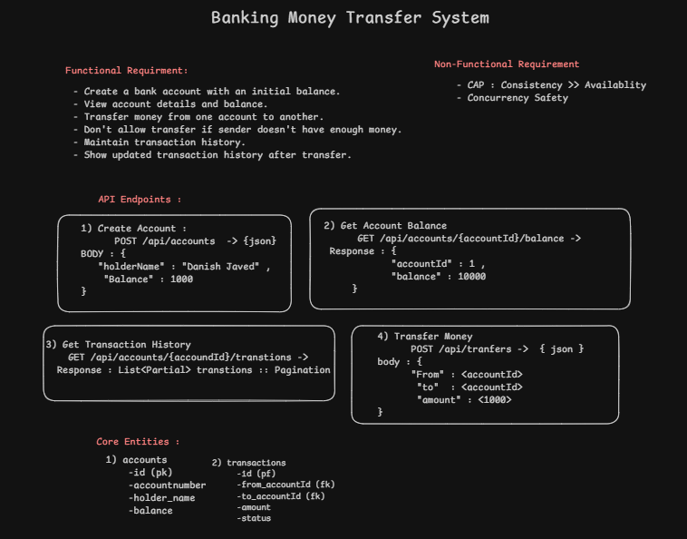

# Banking Money Transfer System

A secure banking web application for creating accounts, checking balances, transferring money, and viewing transaction history.

## Overview

This project has a Node.js + Express backend connected to PostgreSQL via Supabase and a React + Vite frontend styled with Tailwind CSS. It focuses on safe money transfers and consistent account updates.

## System Design



## Tech Stack

### Backend

- Node.js
- Express.js
- PostgreSQL
- Supabase
- JavaScript

### Frontend

- React
- Vite
- Tailwind CSS

## Features

- Create a new bank account with an initial balance
- View account balance
- Transfer money between accounts
- Prevent transfers exceeding available funds
- View transaction history for each account
- Maintain atomic transfer consistency with database transactions
- Handle concurrent transfer safety using locking and rollback logic

## Project Structure

```text
banking-money-transfer-system/
├── server/
│   ├── src/
│   │   ├── controllers/
│   │   ├── db/
│   │   ├── repositories/
│   │   ├── routes/
│   │   ├── services/
│   │   ├── app.js
│   │   └── server.js
│   ├── package.json
│   └── .env
├── frontend/
│   ├── src/
│   ├── package.json
│   ├── vite.config.js
│   ├── tailwind.config.js
│   └── .env
├── docs/
│   └── system-design.png
├── package.json
├── README.md
└── .gitignore
```

## Database

The application uses PostgreSQL through Supabase.

### Accounts Table

```sql
accounts (
  id SERIAL PRIMARY KEY,
  account_number VARCHAR(20) UNIQUE,
  holder_name VARCHAR(100),
  balance NUMERIC(12,2),
  created_at TIMESTAMP DEFAULT NOW(),
  updated_at TIMESTAMP DEFAULT NOW()
)
```

### Transactions Table

```sql
transactions (
  id SERIAL PRIMARY KEY,
  transaction_ref VARCHAR(50) UNIQUE,
  from_account_id INT REFERENCES accounts(id),
  to_account_id INT REFERENCES accounts(id),
  amount NUMERIC(12,2),
  status VARCHAR(20),
  created_at TIMESTAMP DEFAULT NOW()
)
```

## API Endpoints

### Create Account

```http
POST /api/accounts
```

Request body:

```json
{
  "holderName": "Danish Javed",
  "initialBalance": 10000
}
```

### Get Account Balance

```http
GET /api/accounts/:accountId/balance
```

### Get Transaction History

```http
GET /api/accounts/:accountId/transactions
```

### Transfer Money

```http
POST /api/transfers
```

Request body:

```json
{
  "fromAccountId": 1,
  "toAccountId": 2,
  "amount": 2000
}
```

## Setup

### 1. Clone the repository

```bash
git clone <repository-url>
cd "Banking Money Transfer System"
```

### 2. Backend setup

```bash
cd server
npm install
```

Create a `.env` file inside the `server` folder:

```env
PORT=5000
DATABASE_URL=<supabase-postgresql-connection-string>
FRONTEND_URL=http://localhost:5173
```

Start the backend:

```bash
npm run dev
```

### 3. Frontend setup

```bash
cd ../frontend
npm install
```

Create a `.env` file inside the `frontend` folder:

```env
VITE_API_URL=http://localhost:5000/api
```

Start the frontend:

```bash
npm run dev
```

Open the app in the browser:

```text
http://localhost:5173
```

## Sample Test Flow

1. Create Account A with ₹10,000
2. Create Account B with ₹5,000
3. Open Account A
4. Transfer ₹2,000 from Account A to Account B
5. Verify Account A balance becomes ₹8,000
6. Verify Account B balance becomes ₹7,000
7. Check transaction history:
   - Account A: DEBIT ₹2,000
   - Account B: CREDIT ₹2,000
8. Try transferring more than the available balance
9. Confirm the transfer is rejected and balances stay unchanged

## Transfer Consistency

Each transfer is processed inside a single database transaction:

```text
BEGIN
  ↓
Lock accounts
  ↓
Validate balance
  ↓
Debit sender
  ↓
Credit receiver
  ↓
Create transaction record
  ↓
COMMIT
```

If any step fails, the transaction is rolled back automatically. This ensures that funds are never deducted from one account without being credited to the other.

## Future Improvements

- Centralized error handling
- Authentication and authorization
- Transaction pagination
- Automated tests
- Production deployment setup


